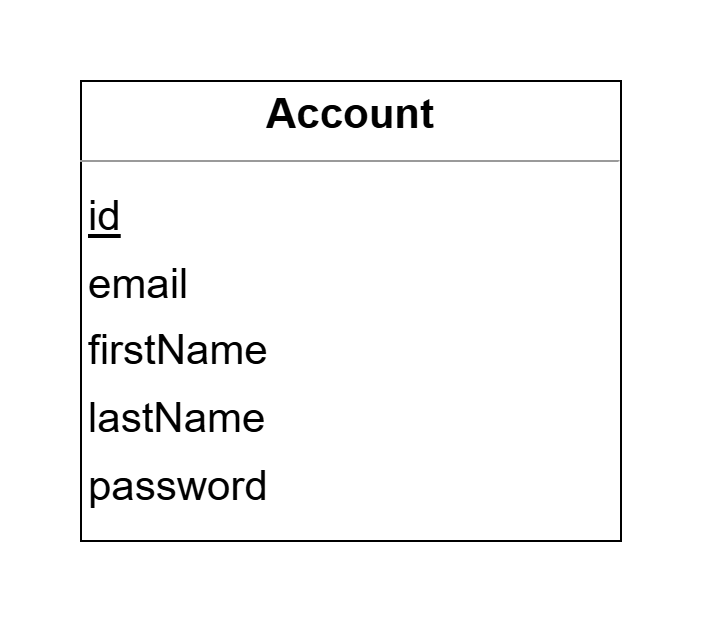

## Overwiew:
MonkeyPoll is a web application for creating, sharing, and analyzing surveys with ease.  

Users can design surveys featuring various question types, including open-ended text responses, numerical inputs, and multiple-choice options. After creating a survey, users can share it for others to complete. Once the survey is closed, creators can review and analyze the responses in a visual format, gaining insights from the data collected.  

The latest online deployment of the application can be found at https://yamp.azurewebsites.net/.

## Authors:
🥇 Amin Zeina (101186297)  
🥇 Michael Kyrollos (101183521)  
🥇 Pathum Danthanarayana (101181411)  
🥇 Yehan De Silva (101185388)

## Project Structure:
The github repository is composed of 2 directories:
1) **/backend**
   - A Spring Boot application serving as the bridge between the frontend and the database, handling API requests and business logic.
2) **/frontend**
   - A React application that enables users to create, share, and analyze surveys through an interactive interface.

## How to Run Project Locally:

### Prerequisites

Make sure you have the following installed and properly configured (Exp: Path environment variables):
- [Java JDK 21+](https://www.oracle.com/ca-en/java/technologies/downloads/)
- [Maven](https://maven.apache.org/) 
- [Node.js and NPM](https://nodejs.org/)

### Steps

**1. Clone the repository:**
   ```
   git clone https://github.com/yehandesilva/MonkeyPoll.git
   cd MonkeyPoll
   ```

**2. Install the required dependencies and build the project:**
```
mvn clean install
```

**3. Run the program:**
```
cd backend
mvn spring-boot:run
   ```
   The application should now be running at http://localhost:8080.

## Diagrams:

### Model - UML Class Diagram:
We have a single model class for each entity in the system. 
Each model class has a corresponding controller class that handles API requests for that entity.


### Database Schema:
We have a single table for each entity in the system. For now, we have a table for Account. 


## Milestones:

### Milestone 1 - Early Prototype:
- Setup project and GitHub repository with CI enabled
- Elicited and documented project requirements
- Created project logos
- Developed frontend welcome and home screens, allowing users to sign up and log in
- Created an Account entity and controller with corresponding JUnit tests
- Implemented account authentication to authenticate user credentials upon log in
- Created up to date UML class diagrams and database schema

### Plans For Next Milestone - Alpha Release:
- Implement all other required entities and controllers along with corresponding JUnit tests
- Allow users to create and share surveys
- Allow users to complete surveys shared with them
