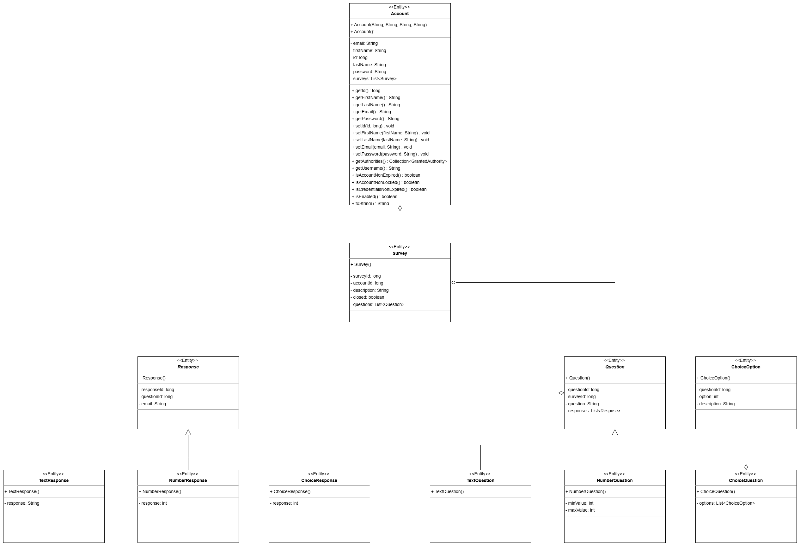

## Overwiew:
MonkeyPoll is a web application for creating, sharing, and analyzing surveys with ease.  

Users can design surveys featuring various question types, including open-ended text responses, numerical inputs, and multiple-choice options. After creating a survey, users can share it for others to complete. Once the survey is closed, creators can review and analyze the responses in a visual format, gaining insights from the data collected.  

The latest online deployment of the application can be found at https://yamp.azurewebsites.net/.

## Authors:
🥇 Amin Zeina (101186297)  
🥇 Michael Kyrollos (101183521)  
🥇 Pathum Danthanarayana (101181411)  
🥇 Yehan De Silva (101185388)

## Project Structure:
The github repository is composed of 3 directories:
1) **/backend**
   - A Spring Boot application serving as the bridge between the frontend and the database, handling API requests and business logic.
2) **/frontend**
   - A React application that enables users to create, share, and analyze surveys through an interactive interface.
3) **/diagrams**
   - All Model UML class diagrams and database schema diagrams

## How to Run Project Locally:

### Prerequisites

Make sure you have the following installed and properly configured (Exp: Path environment variables):
- [Java JDK 21+](https://www.oracle.com/ca-en/java/technologies/downloads/)
- [Maven](https://maven.apache.org/) 
- [Node.js and NPM](https://nodejs.org/)

### Steps

# MonkeyPoll Setup Guide

## Steps

### 1. Clone the Repository
Clone the project repository to your local machine:
```bash
git clone https://github.com/yehandesilva/MonkeyPoll.git
cd MonkeyPoll
```

### 2. Install Dependencies and Build the Project
Use Maven to clean and build the project:
```bash
mvn clean install
```

### 3. Run the Application
Navigate to the backend directory and run the application:
```bash
cd backend
mvn spring-boot:run
```
The application will be available at: [http://localhost:8080](http://localhost:8080)

### 4. (OPTIONAL) Set Up Google Cloud Console for AI API Integration
Follow these steps to configure Google Cloud credentials for generating survey questions:

#### a. Obtain the API Key
Request the Google Cloud Console API Key from the project owner. Save the file in a secure and accessible location, such as:
```plaintext
C:\Users\Micha\.config\google
```

#### b. Configure the Environment Variable
Set the `GOOGLE_APPLICATION_CREDENTIALS` environment variable to the path of the API key file.

**On Windows:**
1. Open the Environment Variables settings.
2. Add a new **System Variable**:
   - Name: `GOOGLE_APPLICATION_CREDENTIALS`
   - Value: `C:\path\to\your\api-key.json`

**On Linux:**
```bash
export GOOGLE_APPLICATION_CREDENTIALS="/path/to/your-api-key.json"
```
#### c. Restart your computer 
This will ensure the system variable change is taken into effect.

#### d. Verify the Environment Variable
To ensure the environment variable is set correctly:

**On Windows (PowerShell):**
```powershell
$env:GOOGLE_APPLICATION_CREDENTIALS
```

**On Linux:**
```bash
echo $GOOGLE_APPLICATION_CREDENTIALS
```

You can also check the environment variable in the IntelliJ console.

### 5. Rebuild and Run the Program
After setting the environment variable, rebuild the project:
```bash
mvn clean install
```

Then, follow Step 3 to run the program again.


## Diagrams:

### Model - UML Class Diagram:
See below for the complete UML class diagram showcasing all models and relationships within the MonkeyPoll application.


### Database Schema:
See below for the complete ER model of how the entities of the MonkeyPoll application are stored in an actual relational database.


## Milestones:

### Milestone 1 - Early Prototype:
- Setup project and GitHub repository with CI enabled
- Elicited and documented project requirements
- Created project logos
- Developed frontend welcome and home screens, allowing users to sign up and log in
- Created an Account entity and controller with corresponding JUnit tests
- Implemented account authentication to authenticate user credentials upon log in
- Created up to date UML class diagrams and database schema

### Milestone 2 - Alpha Release:
- Created a database schema to handle the functionaliy proposed by the application (Represented by diagrams created)
- Implemented all remaining entities with corresponding Junit tests
- Adjusted authentication to ensure proper persistence across sesssions
- Created a survey controller to get specified surveys,post given surveys and get survey responses along with corresponding Junit tests
- Added user interface on frontend to allow users to create surveys and see survey responses
- Added user interface on frontend to allow users to get, fill out and submit surveys

### Milestone 3 - Final Demo:
- Allow creators of surveys to close their surveys, preventing any more responses
- Analyze the responses of surveys and display the results to owners of surveys
- Incorporate Google Cloud AI API to generate survey questions
- Develop Project Topic Circuit Breaker pattern to handle API failures
- Integrate Spring Security to secure all the endpoints and login 
